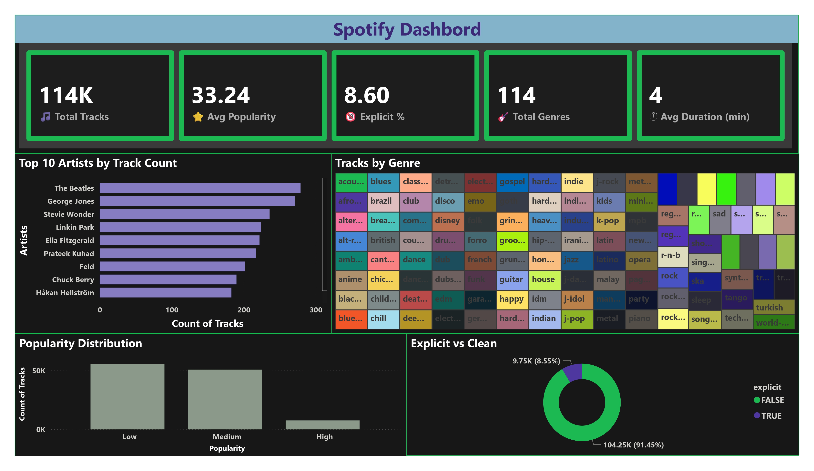
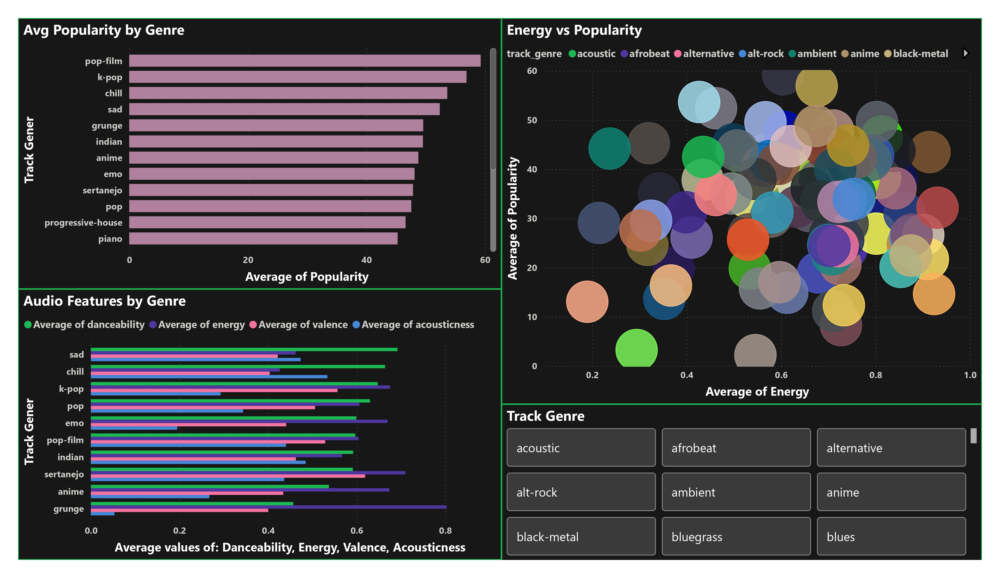
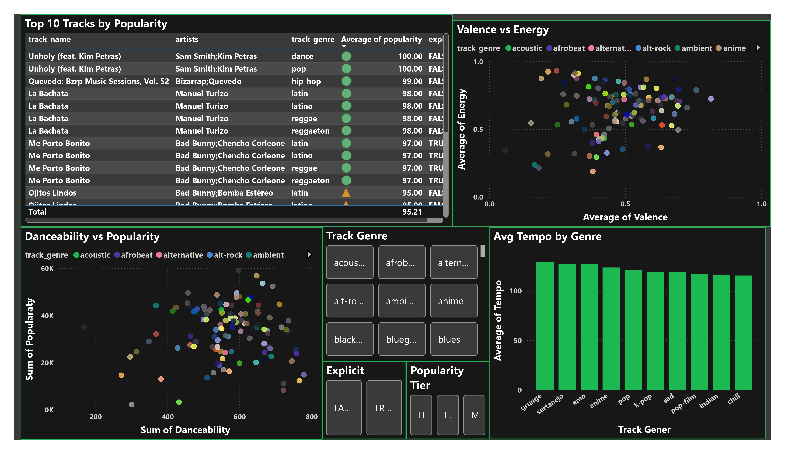
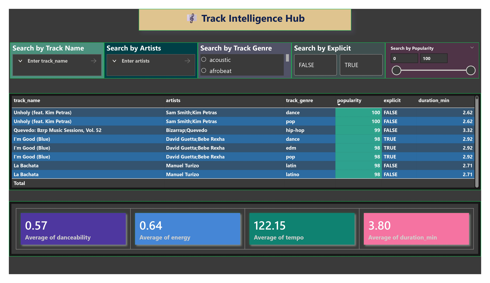

# 🎵 Spotify Track Intelligence

A full end-to-end data analytics project built using **MySQL** and **Power BI**, analyzing 114,000 Spotify tracks across 114 genres to uncover music trends, audio patterns, and popularity insights.

---

## 📸 Dashboard Preview

| Page | Description |
|---|---|
|  | **Overview** — KPIs, top artists, genre treemap |
|  | **Genre Analysis** — Popularity, audio features by genre |
|  | **Track Deep Dive** — Top tracks, tempo, valence vs energy |
|  | **Track Intelligence Hub** — Search & filter any song |

---

## 📊 Project Overview

This project takes raw Spotify track data, loads it into a **MySQL database**, connects it to **Power BI**, and builds a 4-page interactive dashboard that answers:

- Which artists and genres are most popular?
- What audio features make a song a hit?
- How do genres differ in energy, danceability, and mood?
- How can we search and explore any track instantly?

---

## 🗃️ Dataset

- **Source:** [Spotify Tracks Dataset (Kaggle)](https://www.kaggle.com/datasets/maharshipandya/-spotify-tracks-dataset)
- **File:** [dataset.csv](dataset/dataset.csv)
- **Size:** 114,000 rows × 21 columns
- **Key columns:** `track_name`, `artists`, `track_genre`, `popularity`, `danceability`, `energy`, `tempo`, `valence`, `explicit`, `duration_ms`

---

## 🛠️ Tech Stack

| Tool | Purpose |
|---|---|
| **MySQL 8.0** | Database storage and querying |
| **MySQL Workbench** | Database management |
| **Power BI Desktop** | Dashboard creation |
| **Power Query** | Data transformation |
| **DAX** | Calculated measures |

---

## 🚀 Setup Instructions

### Step 1 — Clone the Repository
```bash
git clone https://github.com/vedant-kawale-27/spotify-track-intelligence-powerbi-mysql.git
cd Spotify-Track-Intelligence
```

### Step 2 — Set Up MySQL Database
Open [create_table.sql](database/create_table.sql) in **MySQL Workbench** and run the query.


### Step 3 — Load the Dataset
Copy [dataset.csv](dataset/dataset.csv) to your MySQL secure file path: 'C:/ProgramData/MySQL/MySQL Server 8.0/Uploads/'

Open [load_data.sql](database/load_data.sql) in **MySQL Workbench** and run the query.

### Step 4 — Connect Power BI to MySQL
1. Install **MySQL Connector/NET** from https://dev.mysql.com/downloads/connector/net/
2. Open **Power BI Desktop**
3. **Home → Get Data → MySQL Database**
4. Server: `localhost` | Database: `spotify_db`
5. Select: Database → Enter: User name & Password → Connect 
6. Click **Transform Data**

### Step 5 — Open the Dashboard
Open [Spotify.pbix](dashboard/Spotify.pbix) in Power BI Desktop — all visuals load automatically.

---

## 🔧 Power Query Transformations Applied

- Converted `duration_ms` → `duration_min` (milliseconds to minutes)
- Replaced `explicit` values: `0` → `Clean`, `1` → `Explicit`
- Added `popularity_tier` column: Low / Medium / High
- Trimmed whitespace from `artists`, `track_name`, `album_name`
- Removed duplicate `track_id` entries
- Changed data types for all numeric columns

---

## 📐 DAX Measures

```dax
Total Tracks = COUNTROWS('Spotify Tracks')

Avg Popularity = ROUND(AVERAGE('Spotify Tracks'[popularity]), 2)

Explicit Tracks = COUNTROWS(FILTER('Spotify Tracks', 'Spotify Tracks'[explicit] = "Explicit"))

Explicit % = ROUND(DIVIDE([Explicit Tracks], [Total Tracks]) * 100, 1)

Total Genres = DISTINCTCOUNT('Spotify Tracks'[track_genre])

Avg Duration Min = ROUND(AVERAGE('Spotify Tracks'[duration_min]), 2)
```

---

## 📄 Dashboard Pages

### Page 1 — Music Overview
- 5 KPI Cards: Total Tracks, Avg Popularity, Explicit %, Total Genres, Avg Duration
- Top 10 Artists by Track Count (Bar Chart)
- Popularity Distribution: Low / Medium / High (Column Chart)
- Explicit vs Clean split (Donut Chart)
- Tracks by Genre (Treemap)

### Page 2 — Genre Analysis
- Avg Popularity by Genre (Horizontal Bar Chart)
- Energy vs Popularity by Genre (Scatter Plot)
- Audio Features by Genre: Danceability, Energy, Valence, Acousticness (Clustered Bar)
- Genre Slicer (Dropdown)

### Page 3 — Track & Artist Deep Dive
- Top 10 Tracks by Popularity (Table with conditional formatting)
- Danceability vs Popularity (Scatter Plot)
- Avg Tempo by Genre (Column Chart)
- Valence vs Energy mood map (Scatter Plot)
- Slicers: Genre, Explicit, Popularity Tier

### Page 4 — 🎼 Track Intelligence Hub
- Search by Track Name (Text Slicer)
- Search by Artist (Text Slicer)
- Filter by Genre (List Slicer)
- Explicit Filter (Tile Slicer)
- Popularity Range (Between Slider)
- Results Table: track_name, artists, genre, popularity, explicit, duration_min
- Detail Cards: Avg Danceability, Avg Energy, Avg Tempo, Avg Duration

---

## 📂 File Structure

```
Spotify-Track-Intelligence/
│
├── dataset/
│   └── dataset.csv
│
├── database/
│   ├── create_table.sql
│   └── load_data.sql
│
├── dashboard/
│   └── Spotify.pbix
|   └── Spotify.pdf
│
├── assets/
│   ├── Spotify_page-0001.jpg
│   ├── Spotify_page-0002.jpg
│   ├── Spotify_page-0003.jpg
│   └── Spotify_page-0004.jpg
│
├── README.md
|
└── LICENSE
```

---

## 💡 Key Insights from the Dashboard

- **Pop-film, K-pop, and Chill** are the most popular genres on average
- **The Beatles, George Jones, and Stevie Wonder** have the most tracks in the dataset
- Only **8.6%** of tracks are explicit — most content is clean
- Songs with **higher danceability** tend to have moderately higher popularity
- **Grunge and Sertanejo** genres have the highest average tempo

---

## 🙌 Author

**Vedant Kawal**
- Built with MySQL + Power BI
- Dataset: Spotify Tracks (Kaggle)
- Tools: MySQL Workbench 8.0, Power BI Desktop

---

## 📜 License

This project is open source under the [MIT License](LICENSE).
